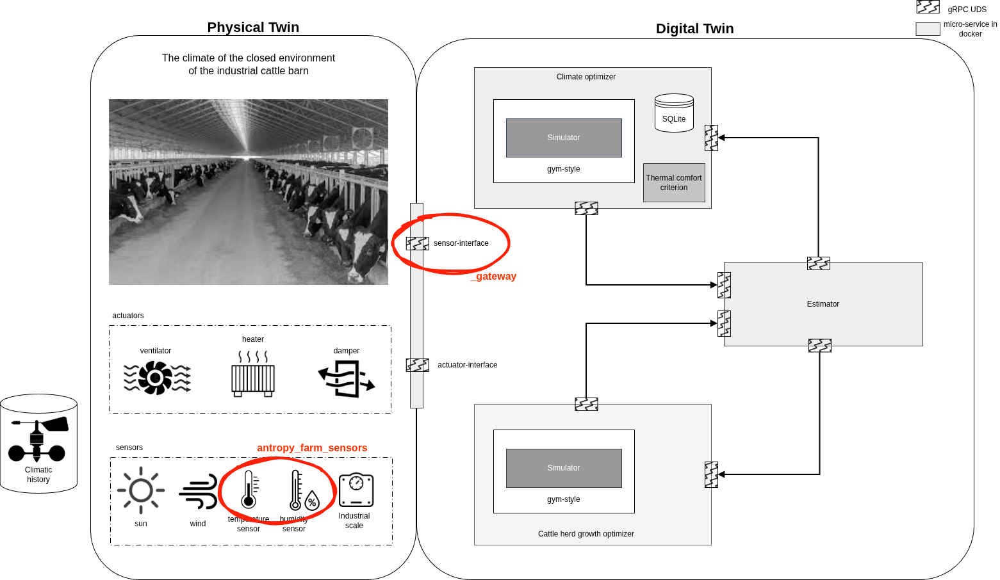

# antropy_farm_gateway

## Summary

`antropy_farm_gateway` implements the article's central idea that optimal sensor placement in a controlled environment should be chosen quantitatively rather than by habit or by always placing one sensor at the geometric centre. The gateway collects multi-point temperature and humidity streams, builds reference and combination trends, evaluates all available sensor combinations, and emits ranked outputs for both representative monitoring and disturbance-sensitive monitoring.

The article itself focused on greenhouse air temperature measured at nine internal locations, but the software package generalises the same workflow to a hall-style facility description in `settings.json` and applies the same computational pipeline to humidity as a practical extension. The core decision logic remains grounded in the article's error-based and entropy-based methods.

## Introduction

Large controlled facilities such as greenhouses, poultry houses, and cattle barns rarely have a perfectly uniform internal climate. Temperature and humidity vary with geometry, ventilation, external weather, sidewalls, roof openings, heaters, crop or animal density, and operational strategy. In practice, only a limited number of sensors can usually be installed, so poor sensor placement can make the monitored value unrepresentative of the actual facility state.

The attached article addressed this problem for a naturally ventilated and heat-pump-conditioned greenhouse. It showed that the common assumption that the centre sensor always represents the whole facility is not reliable under all seasonal and control conditions. For that reason, the gateway in this repository is designed to evaluate sensor positions quantitatively, preserve the full ranking logic, and expose the resulting best sensor combinations to downstream control services.

Optimization diagram of temperature and humidity sensors in the hall:




## Problem questions

1. Can a small number of sensors accurately represent the entire internal environment of a controlled facility?
2. Is the geometric centre of the facility always the best place for a control sensor?
3. Which sensor combinations best approximate the reference trend formed by all installed sensors?
4. Which sensor combinations best detect areas with large environmental variability or external disturbance?
5. How should a central node compare all candidate combinations when only limited sensor counts are available?
6. How can the selected combinations be turned into a practical gateway output for a downstream decision microservice?

## Approach and answers to the questions

### 1) Representative monitoring question
The package answers the representative-monitoring question with the **error-based method**. It computes a reference trend using the average of all sensors, computes one trend for every candidate subset, forms an error trend for each subset, and ranks the subsets using mean error, standard deviation, outliers, and z-index.

**Answer:** the best subset is the one with the highest performance index, not necessarily the one containing the centre sensor.

### 2) Disturbance-detection question
The package answers the variability-detection question with the **entropy-based method**. It estimates per-sensor entropy from binned measurements, evaluates joint and total entropy for subsets, and ranks the combinations by information richness and low redundancy.

**Answer:** the best disturbance-detection subset is the one with the highest total entropy, typically favouring positions more affected by external air inflow, side effects, or uneven heating/cooling.

### 3) Limited-sensor deployment question
The package enumerates all non-empty sensor combinations up to the configured selection size and reports ranked subsets for one sensor, two sensors, and larger sets.

**Answer:** the optimal answer depends on the number of sensors available, the season, and whether the user wants a facility-average control point or a variability-sensitive monitoring point.

### 4) Practical gateway question
The package stores raw received packets in SQLite, keeps a rolling history, runs the article-style computations on the central Raspberry Pi node, and sends a compact binary report over the `sensors-interface` Unix domain socket.

**Answer:** the gateway can act as the local optimisation and aggregation node between LoRa sensor traffic and a downstream decision service.

## Explanation of formalisms

### 1) Reference trend formalism
The article assumes that the average of all installed sensors represents the overall greenhouse environment.

\[
R_t = \frac{1}{n}\sum_{k=1}^{n} T_{k,t}
\]

Where:
- \(R_t\) is the reference trend at time step \(t\)
- \(n\) is the total number of installed sensors
- \(T_{k,t}\) is the measured value from sensor \(k\) at time \(t\)

In the package, this same arithmetic mean is used as the baseline trend for temperature and, by extension, humidity.

### 2) Combination trend formalism
For each selected subset of sensors, the package computes a subset trend.

\[
C_t = \frac{1}{p}\sum_{k \in S} T_{k,t}
\]

Where:
- \(C_t\) is the combination trend at time step \(t\)
- \(p\) is the number of selected sensors in subset \(S\)
- \(S\) is the selected sensor set

This formalism is used to compare every candidate subset against the all-sensor reference trend.

### 3) Error trend formalism
The article evaluates each subset through the difference between the reference and combination trends.

\[
E_t = R_t - C_t
\]

Where:
- \(E_t\) is the error trend at time step \(t\)
- \(R_t\) is the reference trend
- \(C_t\) is the combination trend

The package then derives ranking statistics from this error series.

### 4) Performance index formalism
The error-based ranking uses the article's performance index.

\[
I_i = S_1(E_i) + S_2(E_i) + S_3(E_i) + S_4(E_i)
\]

Where:
- \(I_i\) is the performance index for sensor combination \(i\)
- \(S_1\) is the score for mean error
- \(S_2\) is the score for standard deviation of error
- \(S_3\) is the score for outlier count
- \(S_4\) is the score for z-test or z-index behaviour

Higher \(I_i\) means a better subset for representing the full facility.

### 5) Ranking score formalism
The article scores rankings using the table-based rule:

\[
S_i = (2^n - 1 - R + 1)
\]

Where:
- \(2^n - 1\) is the number of non-empty combinations
- \(R\) is the rank of a given combination for a given statistic
- \(S_i\) is the resulting score contribution

The package follows this ranking idea to preserve the article's combination-order logic.

### 6) Information entropy formalism
The article uses entropy to prefer sensor locations with high information content.

\[
H(X) = \sum_{i=1}^{m} P_i(E)\log_2 P_i(E)
\]

Where:
- \(H(X)\) is the information entropy for one sensor
- \(P_i(E)\) is the probability mass function of the measured variable in bin \(i\)
- \(m\) is the number of bins over the sensor's measured range

In practice, the package uses Shannon-style entropy over histogram bins and ignores zero-probability bins.

### 7) Joint entropy formalism
The article also states:

\[
H(X,Y) = H(X) + H(Y|X)
\]

Where:
- \(H(X,Y)\) is the joint entropy of two sensors
- \(H(Y|X)\) is conditional entropy

This supports the idea that an optimal subset should maximise information while reducing redundancy.

### 8) Total entropy formalism
The article's total-entropy criterion is:

\[
\sum_{i=1}^{n} T(X_i, X_j, \ldots, X_p) = H(X_k) + \cdots + H(X_p) + \sum_{i=1}^{n-p}\sum_{j=k}^{p} H(X_i, X_j)
\]

Where:
- the first term sums entropy across selected sensors
- the second term captures information delivered from unselected sensors to selected sensors
- \(n\) is the total sensor count
- \(p\) is the selected sensor count

The package implements a practical selected-plus-pairwise-information approximation consistent with this formulation.

### 9) RMSE formalism
The article verifies how closely a subset follows the reference trend using RMSE.

\[
RMSE = \sqrt{\frac{\sum_{i=1}^{N}(R_i - C_i)^2}{N}}
\]

Where:
- \(RMSE\) is root mean square error
- \(N\) is the total number of samples
- \(R_i\) is the reference trend value at sample \(i\)
- \(C_i\) is the combination trend value at sample \(i\)

Lower RMSE means the chosen subset better represents the all-sensor trend.

### 10) MAPE formalism
The article also uses percentage error.

\[
MAPE = \frac{100}{N}\sum_{i=1}^{N}\left|\frac{R_i - C_i}{R_i}\right|
\]

Where:
- \(MAPE\) is mean absolute percentage error
- \(N\) is the total number of samples
- \(R_i\) is the reference trend value
- \(C_i\) is the combination trend value

Lower MAPE means the subset reproduces the reference trend more accurately in relative terms.

### 11) z-index formalism
The article uses a z-index for the error trend distribution.

\[
z\text{-index} = \frac{mean(Error)}{sd(Error)}
\]

Where:
- `mean(Error)` is the average error over time
- `sd(Error)` is the standard deviation of the error trend

The intent is to prefer error behaviour closer to a stable Gaussian-like distribution and less dominated by external disturbances.

## Results

### Results from the article
- The centre of the greenhouse was **not always** the best representative sensor location.
- In July, the single best representative location by the error-based method was **P-5**.
- In February, the single best representative location by the error-based method was **P-4**.
- For two sensors, **P-1 and P-9** were selected by the error-based method in both July and February.
- In July, the entropy-based method preferentially selected **P-4, P-5, and P-7**, which were more exposed to external wind effects.
- In February, entropy was lower in the central locations **P-4, P-5, and P-6**, so edge-side locations were selected earlier.
- The article reported the best single-sensor July RMSE/MAPE at **P-5 = 0.53 °C / 1.23%** and the best single-sensor February RMSE/MAPE at **P-4 = 0.74 °C / 4.96%**.

### Results for this package
- The package preserves the article's two-objective logic: one ranking for representative control sensing and one ranking for variability-sensitive sensing.
- Raw sensor packets are persisted in SQLite before ranking.
- The gateway supports test-mode replay from `mock_lora_input.csv` and real-mode ingestion from the configured LoRa device.
- The ranked outputs are sent through the `sensors-interface` Unix domain socket in a documented binary message layout.
- The current implementation extends the temperature workflow to humidity for engineering convenience; this is useful operationally, but the article validated the method only for temperature.

## References

1. Lee, S.-y., Lee, I.-b., Yeo, U.-h., Kim, R.-w., & Kim, J.-g. (2019). *Optimal sensor placement for monitoring and controlling greenhouse internal environments*. Biosystems Engineering, 188, 190-206. https://doi.org/10.1016/j.biosystemseng.2019.10.005
2. Arnesano, M., Revel, G. M., & Seri, F. (2016). Error-based sensor placement approach referenced by the article for representative monitoring.
3. Shannon, C. E., & Weaver, W. (1949). *The Mathematical Theory of Communication*. Referenced by the article for information entropy.
4. Chang, H., Ha, J., Jun, H., & Kang, T. (2012). Entropy-based sensor placement approach referenced by the article.

## Notes on adaptation to poultry and cattle facilities

The article itself studied a greenhouse, not poultry or cattle buildings. This package adapts the same ranking workflow to any hall-like controlled facility described in `settings.json`. That makes it suitable for experimentation in greenhouse, poultry, and cattle contexts, but the article-backed validation remains strongest for greenhouse air temperature. For animal buildings, the same methods should be treated as a structured engineering adaptation that still needs domain-specific calibration, especially for sensor height, airflow regime, and building-specific disturbance patterns.

## Project layout

```text
antropy_farm_gateway/
├── CMakeLists.txt
├── Dockerfile
├── docker-compose.yml
├── README.md
├── config/
│   ├── settings.json
│   └── mock_lora_input.csv
├── include/antropy_farm_gateway/
├── proto/sensors_interface.proto
├── scripts/
│   ├── docker-start.sh
│   └── docker-stop.sh
└── src/
```

## `settings.json`

The package stores facility and algorithm data in `config/settings.json`.

Included fields:
- facility identifier
- hall length, width, total height, eave height, ridge height
- ceiling, floor, north/south/east/west wall material metadata
- vent positions and dimensions
- sensor coordinates `(x,y,z)`
- LoRa/SX127x transport settings
- Raspberry Pi 5 SPI and GPIO pin mapping for the SX127x module
- gRPC/UDS destination settings
- algorithm parameters such as bin widths, tolerances, rolling window size, and maximum selected combination size
- SQLite storage settings for raw received sensor data

The provided example is filled with article-inspired greenhouse geometry and nine positions at 0.9 m height. Replace these with your greenhouse, poultry house, or cattle building geometry as needed.

## LoRa ingestion contract

This source package uses a clean adapter boundary for the radio layer. The receiver expects the SX127x side to emit one CSV line per packet in this format:

```text
sensor_id,temperature_c,humidity_pct,unix_ms
```

Example:

```text
5,28.490,64.500,1711200000000
```

For immediate testing, the package ships with `config/mock_lora_input.csv`, but the default `config/settings.json` now uses `"run_mode": "real"`, so `./build/antropy_farm_gateway config/settings.json` reads only live sensor lines from the configured `lora.device` path.

## SQLite storage

Each received sensor packet is inserted into a SQLite database before optimization continues.

When you run the binary directly on the host, the packaged default database path is project-local: `data/antropy_gateway.db`.
This avoids permission errors from writing to system directories such as `/var/lib/...` outside Docker.

Default database block in `settings.json`:

```json
"database": {
  "enabled": true,
  "path": "data/antropy_gateway.db"
}
```

Created table:

```sql
CREATE TABLE IF NOT EXISTS sensor_readings (
  id INTEGER PRIMARY KEY AUTOINCREMENT,
  sensor_id INTEGER NOT NULL,
  temperature_c REAL NOT NULL,
  humidity_pct REAL NOT NULL,
  timestamp_ms INTEGER NOT NULL
);
```

This stores the raw incoming stream from real sensors or the mock input during test mode inside the container filesystem.

## `sensors-interface` client-side output format

The source tree keeps `proto/sensors_interface.proto` as the logical schema reference, but the current runtime sender does **not** marshal a real protobuf/gRPC frame. For compatibility with the earlier package naming, the transport class is still called `GrpcClient`; however, the implementation in `src/grpc_client.cpp` writes a **custom binary payload** over a Unix domain socket stream to the configured `grpc.uds_path` for the `sensors-interface` endpoint.

So the receiver on the microservice side should currently behave as a **UDS stream reader for a length-known custom binary record**, not as a generated gRPC stub.

### On-wire field order

All integer and floating-point values are written in **little-endian** order.
Strings are encoded as:
- `uint32 length`
- raw UTF-8 bytes

The payload layout is:

1. `string magic` → always `"AFGW"`
2. `uint32 protocol_version` → currently `1`
3. `string interface_name`
4. `string facility_id`
5. `string created_at_utc`
6. `string metric_name`
7. `uint32 total_sensors`
8. `uint32 samples_per_sensor`
9. `uint32 point_count`
10. repeated `point_count` times:
   - `uint32 sensor_id`
   - `string label`
   - `double x_m`
   - `double y_m`
   - `double z_m`
   - `double latest_temperature_c`
   - `double latest_humidity_pct`
11. `uint32 error_based_count`
12. repeated `error_based_count` times:
   - `uint32 sensor_id_count`
   - repeated `sensor_id_count` times: `uint32 sensor_id`
   - `double performance_index`
   - `double total_entropy`
   - `double rmse`
   - `double mape`
   - `double mean_error`
   - `double stddev_error`
   - `uint32 outlier_count`
   - `double z_index`
13. `uint32 entropy_based_count`
14. repeated `entropy_based_count` times with the exact same row structure as above

### Meaning of the transmitted fields

- `magic`: sanity check so the receiver can reject unrelated socket traffic
- `protocol_version`: decoder version guard
- `interface_name`: normally `sensors-interface`
- `facility_id`: facility identifier from `settings.json`
- `created_at_utc`: gateway UTC emission timestamp in ISO-8601 format
- `metric_name`: `temperature_c` or `humidity_pct`
- `total_sensors`: number of configured sensor positions
- `samples_per_sensor`: current rolling-history length used by the optimizer
- point section: latest values and coordinates for each configured sensor
- error-based rows: best combinations according to the article-style performance index
- entropy-based rows: best combinations according to the entropy objective

### Example receiver behavior

The receiver should:
1. accept a Unix domain socket connection on the configured path;
2. read the full byte stream until EOF;
3. decode fields in the exact order above;
4. verify `magic == "AFGW"` and `protocol_version == 1`;
5. reject the message if any count would overrun the available bytes.

### Minimal Python receiver example

```python
import os
import socket
import struct

SOCK_PATH = "/tmp/sensors-interface.sock"


def read_u32(buf, off):
    return struct.unpack_from("<I", buf, off)[0], off + 4


def read_f64(buf, off):
    return struct.unpack_from("<d", buf, off)[0], off + 8


def read_string(buf, off):
    n, off = read_u32(buf, off)
    s = buf[off:off+n].decode("utf-8")
    return s, off + n


def read_combo_rows(buf, off):
    rows = []
    count, off = read_u32(buf, off)
    for _ in range(count):
        sid_count, off = read_u32(buf, off)
        sensor_ids = []
        for _ in range(sid_count):
            sid, off = read_u32(buf, off)
            sensor_ids.append(sid)
        performance_index, off = read_f64(buf, off)
        total_entropy, off = read_f64(buf, off)
        rmse, off = read_f64(buf, off)
        mape, off = read_f64(buf, off)
        mean_error, off = read_f64(buf, off)
        stddev_error, off = read_f64(buf, off)
        outlier_count, off = read_u32(buf, off)
        z_index, off = read_f64(buf, off)
        rows.append({
            "sensor_ids": sensor_ids,
            "performance_index": performance_index,
            "total_entropy": total_entropy,
            "rmse": rmse,
            "mape": mape,
            "mean_error": mean_error,
            "stddev_error": stddev_error,
            "outlier_count": outlier_count,
            "z_index": z_index,
        })
    return rows, off


if os.path.exists(SOCK_PATH):
    os.unlink(SOCK_PATH)

server = socket.socket(socket.AF_UNIX, socket.SOCK_STREAM)
server.bind(SOCK_PATH)
server.listen(1)

conn, _ = server.accept()
data = bytearray()
while True:
    chunk = conn.recv(65536)
    if not chunk:
        break
    data.extend(chunk)
conn.close()
server.close()

off = 0
magic, off = read_string(data, off)
version, off = read_u32(data, off)
interface_name, off = read_string(data, off)
facility_id, off = read_string(data, off)
created_at_utc, off = read_string(data, off)
metric_name, off = read_string(data, off)
total_sensors, off = read_u32(data, off)
samples_per_sensor, off = read_u32(data, off)

assert magic == "AFGW"
assert version == 1

point_count, off = read_u32(data, off)
points = []
for _ in range(point_count):
    sensor_id, off = read_u32(data, off)
    label, off = read_string(data, off)
    x_m, off = read_f64(data, off)
    y_m, off = read_f64(data, off)
    z_m, off = read_f64(data, off)
    latest_temperature_c, off = read_f64(data, off)
    latest_humidity_pct, off = read_f64(data, off)
    points.append({
        "sensor_id": sensor_id,
        "label": label,
        "x_m": x_m,
        "y_m": y_m,
        "z_m": z_m,
        "latest_temperature_c": latest_temperature_c,
        "latest_humidity_pct": latest_humidity_pct,
    })

error_based, off = read_combo_rows(data, off)
entropy_based, off = read_combo_rows(data, off)

print({
    "interface_name": interface_name,
    "facility_id": facility_id,
    "created_at_utc": created_at_utc,
    "metric_name": metric_name,
    "total_sensors": total_sensors,
    "samples_per_sensor": samples_per_sensor,
    "points": points,
    "best_error_based": error_based,
    "best_entropy_based": entropy_based,
})
```

### Example interpretation for the receiver

A compliant receiver should interpret the message as:
- one full optimization report per socket connection;
- latest facility-wide sensor snapshot first;
- then ranked error-based combinations;
- then ranked entropy-based combinations.

If a true gRPC server is needed later, the preserved `.proto` file can be used as the target schema for a transport upgrade, but that is **not** the byte format emitted by the current package version.

## Build locally

```bash
cmake -S . -B build
cmake --build build -j
```

Run with:

```bash
./build/antropy_farm_gateway config/settings.json
```

## Run with Docker

Build and start the service:

```bash
./scripts/docker-start.sh
```

Stop and remove the service container:

```bash
./scripts/docker-stop.sh
```

Or directly:

```bash
docker compose up -d --build antropy_farm_gateway
```

## Raspberry Pi 5 deployment notes

- Set `lora.enable_mock_input` to `false`.
- Replace the adapter behind `src/lora_receiver.cpp` with the SX127x serial/SPI reader used in your stack.
- Keep the packet schema unchanged unless you also update the parser.
- Mount `/tmp` or another shared path so the UDS socket is reachable by both the gateway container and the decision-node container.

## What is article-faithful and what is engineered here

Article-faithful parts:
- averaging all sensors as the reference trend;
- averaging selected sensors as the combination trend;
- error-based ranking with mean, standard deviation, outliers, and z-index;
- performance index summation;
- entropy binning and total-entropy-style ranking;
- RMSE and MAPE verification.

Engineered extensions in this package:
- real-time streaming over LoRa;
- protobuf/gRPC output over UDS;
- facility geometry stored in JSON;
- humidity processed through the same ranking pipeline;
- Docker packaging and start/stop scripts.

## Validation status

The source tree is complete and packaged, but the hardware-specific SX127x driver path and the downstream `sensors-interface` server were not available in this environment, so end-to-end radio and gRPC runtime validation against real hardware was not performed here.


## Local build

```bash
cmake -S . -B build
cmake --build build -j
```

No Protobuf or gRPC package is required for this build. The project links against pthreads and SQLite3.

## SX127x to Raspberry Pi 5 wiring in `settings.json`

This package now stores the SX127x hardware mapping inside the `lora.sx127x_pins` block of `config/settings.json`.

Default wiring used by the package:
- `gpio_mosi: 10` → Raspberry Pi SPI0 MOSI
- `gpio_miso: 9` → Raspberry Pi SPI0 MISO
- `gpio_sck: 11` → Raspberry Pi SPI0 SCLK
- `gpio_cs: 8` → Raspberry Pi SPI0 CE0 / chip-select
- `gpio_reset: 25` → SX127x RESET
- `gpio_dio0: 24` → SX127x DIO0 interrupt
- `gpio_dio1: 23` → SX127x DIO1 interrupt
- `gpio_dio2: -1` → optional / unused by default
- `gpio_busy: -1` → optional / unused for SX127x
- `gpio_rxen: -1` and `gpio_txen: -1` → optional RF front-end control lines

The `-1` value means that the line is not used in the packaged default configuration.

Example block:

```json
"lora": {
  "device": "/dev/spidev0.0",
  "baud_rate": 115200,
  "mock_input_file": "config/mock_lora_input.csv",
  "enable_mock_input": true,
  "transport": "spi",
  "module_family": "sx127x",
  "sx127x_pins": {
    "spi_bus": 0,
    "spi_chip_select": 0,
    "gpio_mosi": 10,
    "gpio_miso": 9,
    "gpio_sck": 11,
    "gpio_cs": 8,
    "gpio_reset": 25,
    "gpio_dio0": 24,
    "gpio_dio1": 23,
    "gpio_dio2": -1,
    "gpio_busy": -1,
    "gpio_rxen": -1,
    "gpio_txen": -1
  }
}
```

These settings document the intended Raspberry Pi 5 wiring without changing the current gateway behavior. The packaged receiver still uses the existing mock/adapter boundary unless you replace it with a hardware-specific SX127x SPI implementation.

## Runtime input behavior

The gateway now separates **test mode** from **real mode** in `config/settings.json`:

- `"run_mode": "real"` → ignore `mock_lora_input.csv` and read only live sensor data from `lora.device`
- `"run_mode": "test"` + `"enable_mock_input": true` → read replay data from `lora.mock_input_file`

Example real-time block:

```json
"lora": {
  "device": "/tmp/antropy_lora_feed",
  "baud_rate": 115200,
  "run_mode": "real",
  "mock_input_file": "config/mock_lora_input.csv",
  "enable_mock_input": true
}
```

Example test block:

```json
"lora": {
  "device": "/tmp/antropy_lora_feed",
  "baud_rate": 115200,
  "run_mode": "test",
  "mock_input_file": "config/mock_lora_input.csv",
  "enable_mock_input": true
}
```

In real mode, the package expects a live CSV line stream at `lora.device` with the format `sensor_id,temperature_c,humidity_pct,unix_ms`. This keeps testing file replay available without allowing the production command to silently consume the mock file.
